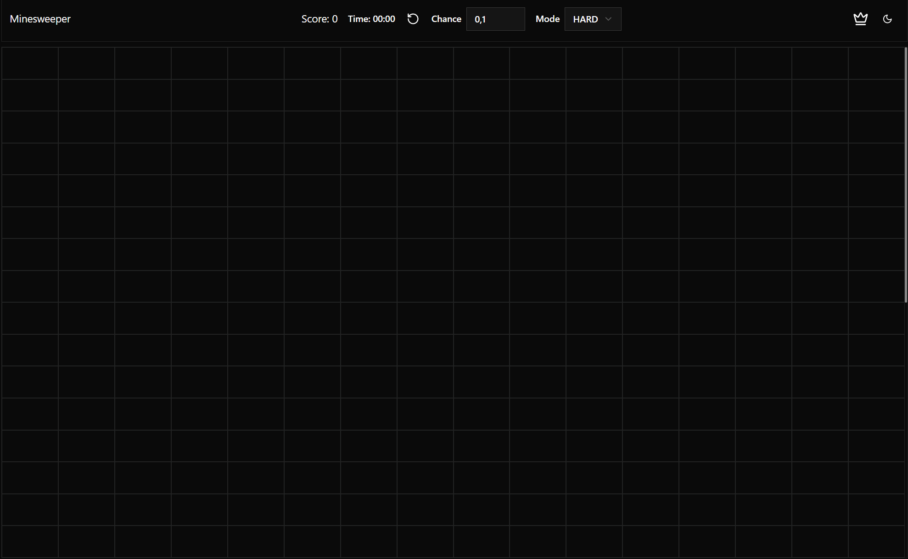

# 🎮 Minesweeper Game

[](https://your-game-link.com)
[](LICENSE)
[](https://react.dev)
[](https://www.typescriptlang.org)

Современный клон игры "Сапёр" с продвинутыми возможностями



## ✨ Особенности

- Полностью адаптивный интерфейс
- Система звуков
- Темный/светлый режим
- Сохранение прогресса (Redux Persist)

## 🛠 Технологический стек

### Основные технологии

- **React 19** (с хуками)
- **TypeScript** (строгая типизация)
- **Vite** (ультрабыстрая сборка)
- **Tailwind CSS** (стилизация + анимации)
- **Redux Toolkit** (управление состоянием)

### Ключевые зависимости

| Категория        | Библиотеки                   |
| ---------------- | ---------------------------- |
| UI Components    | Radix UI, Lucide Icons       |
| State Management | Redux Toolkit, Redux Persist |
| Styles           | Tailwind + tailwind-merge    |
| Routing          | React Router DOM v7          |

## 🚀 Быстрый старт

### Установка

```bash
git clone https://github.com/yourname/minesweeper-game.git
cd minesweeper
npm install
```
